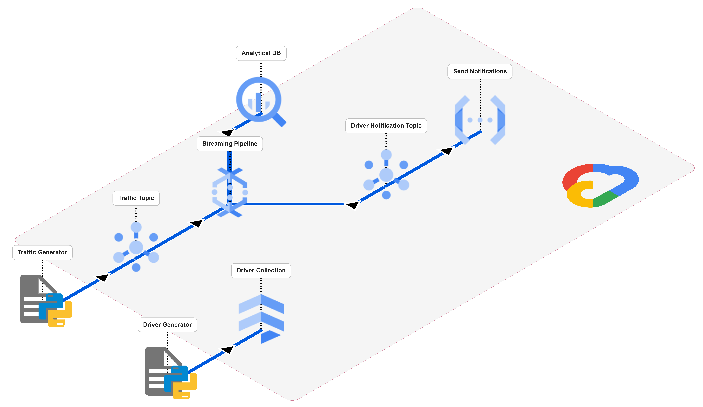

# Traffic Violation Processing System.

## Overview.

This project is a Serverless Real-Time Data Processing System designed to simulate, detect, and process traffic violations (speeding) using Google Cloud Platform (GCP).

The system utilizes an Event-Driven Architecture where telemetry is ingested via Pub/Sub, processed in streaming mode by Dataflow (Apache Beam), and stored in BigQuery for analytics. Simultaneously, Cloud Functions trigger enforcement actions against driver records in Firestore and instantly send email notifications to the offenders.

## Architecture.



The system architecture is divided into two decoupled workflows:

1.  **Telemetry Stream (Real-Time Flow):**
    * **Traffic Generator:** A Python script that emits high-frequency vehicle telemetry data.
    * **Traffic Topic:** Acts as an ingestion buffer using Pub/Sub to handle load spikes.
    * **Streaming Pipeline:** Dataflow (Apache Beam) performs session windowing to calculate average speed and detect infractions.
    * **Driver Notification Topic:** An event bus that decouples the detection logic from the alerting system.
    * **Send Notifications:** A Cloud Function that executes the enforcement logic (fine issuance and email dispatch).

2.  **Data Management & Analytics:**
    * **Driver Generator:** Seeds the **Driver Collection** (Firestore) with mock user identities and license points.
    * **Analytical DB:** Persists processed violations in **BigQuery** for historical analysis and reporting.

## Project Structure. 

````plaintext
radar_processing
├── README.md                # Project documentation and setup guide
├── dataflow
│   └── radar_pipeline.py    # Streaming pipeline (Apache Beam) for speed calculation & detection
├── function
│   ├── function.zip         # Pre-packaged source code for Terraform deployment
│   ├── main.py              # Cloud Function logic (Fine issuance, Firestore update & Email)
│   └── requirements.txt     # Dependencies specific to the Cloud Function environment
├── generators
│   ├── driver_generator.py  # Script to seed Firestore with mock driver data
│   └── traffic_generator.py # Script to simulate vehicle telemetry and publish to Pub/Sub
├── requirements.txt         # Local environment dependencies for running generators & pipeline
└── terraform
    ├── main.tf              # Infrastructure definitions (Pub/Sub, BigQuery, GCF, Firestore)
    ├── providers.tf         # Google Cloud Provider configuration
    └── variables.tf         # Input variables (Project ID, Region, etc.)
````

## Prerequisites.

Before deploying the solution, ensure you have the following tools and accounts set up:

* **Google Cloud Platform (GCP) Account:** An active GCP project with billing enabled.
* **Anaconda or Miniconda:** To manage the Python environment.
* **Terraform:** Installed locally to provision the infrastructure.
* **Google Cloud SDK (`gcloud`):** Installed and authenticated to interact with GCP services.

### Required APIs.

To allow Terraform to create resources, you must enable the following APIs in your project. You can do this via the Console or by running this command:

````sh
gcloud services enable \
    compute.googleapis.com \
    dataflow.googleapis.com \
    pubsub.googleapis.com \
    firestore.googleapis.com \
    cloudfunctions.googleapis.com \
    cloudbuild.googleapis.com \
    artifactregistry.googleapis.com \
    bigquery.googleapis.com \
    run.googleapis.com
````

Note: `cloudbuild`, `artifactregistry`, and `run` are required for deploying 2nd Gen Cloud Functions.

### Local Authentication.

Make sure your local environment is authenticated so Terraform can access your GCP project:

````sh
gcloud auth login
gcloud auth application-default login
````

### Terraform Configuration (terraform.tfvars).

You must create a `terraform.tfvars` file inside the `terraform/` directory to define your project variables automatically.

File: `terraform/terraform.tfvars` Content:

````tf
project_id = "<project-id-GCP>"
region = "<region-in-GCP>"
zone = "<zone-in-GCP>"
````

## Installation & Deployment.

Follow these steps to deploy the infrastructure and start the processing pipeline.

### 1. Local Environment Setup

First, install the necessary Python dependencies for the local generators and the Dataflow launcher.

````sh
# Create and activate a conda environment (Optional but recommended)
conda create --name <env-name> python=3.12
conda activate <env-name>

# Install dependencies
pip install -r requirements.txt
````

### 2. Infrastructure Deployment (Terraform).

We use Terraform to provision the Cloud Storage buckets, Pub/Sub topics, Firestore database, BigQuery datasets, and the Cloud Function.

````sh
# Enter into the directory
cd terraform/ 

# Initialize Terraform
terraform init

# Print the Terraform plan
terraform plan

# Apply the configuration
terraform apply
````

### 3. Database Seeding

Before processing traffic, populates the Firestore database with mock driver data (licenses, points, emails) so the system can perform lookups.

````sh
# Into the terraform/ directory
cd ../generators/

# Into the radar_processing/ directory
cd generators/

# Active driver_generator
python driver_generator.py \
    --project_id <project-id-GCP>
````

### 4. Deploy Dataflow Pipeline.

Launch the streaming pipeline to Google Cloud Dataflow. This step submits the job to the cloud runner.

````sh
# Into the generators/ directory
cd ../dataflow/

# Into the radar_processing/ directory
cd dataflow/

python radar_pipeline.py\
    --project_id <project-id-in-GCP> \
    --traffic_subscription radar-topic-sub \
    --runner DataflowRunner \
    --region <region-in-GCP> \
    --temp_location gs://dataflow-temp-<project-id-in-GCP>/temp \
    --staging_location gs://dataflow-temp-<project-id-in-GCP>/staging \
    --job_name <job-name>
````

### 5. Start Traffic Simulation.

Once the Dataflow job status is "Running" in the Google Cloud Console, start the traffic generator to simulate vehicles passing the radar.

````sh
# Into the dataflow/ directory
cd ../generators/

# Into the radar_processing/ directory
cd generators/

# Active driver_generator
python driver_generator.py \
    --project_id <project-id-GCP> \
    --traffic_topic radar-topic
````